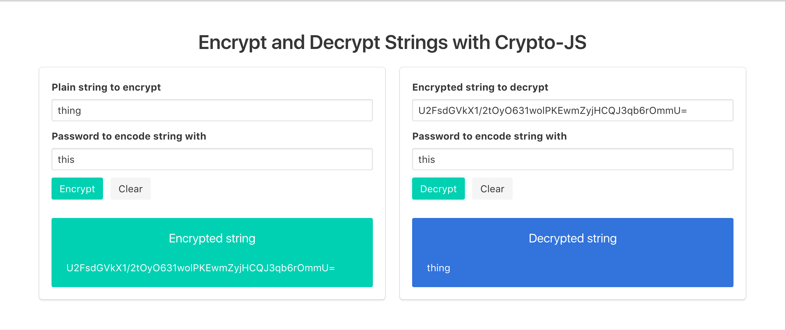

# Encrypt and decrypt strings in a UI with Crypto-JS

## [Live site](http:/mindplace.github.io/encrypt-string-with-javascript/)

## Libraries used

* [Crypto-JS](https://github.com/sytelus/CryptoJS), specifically the [aes.js rollup](https://github.com/sytelus/CryptoJS/blob/master/rollups/aes.js)
* [This StackOverflow answer](https://stackoverflow.com/questions/18279141/javascript-string-encryption-and-decryption) on using Crypto-JS to encrypt and decrypt strings
* [Bulma](http://bulma.io/) CSS framework
